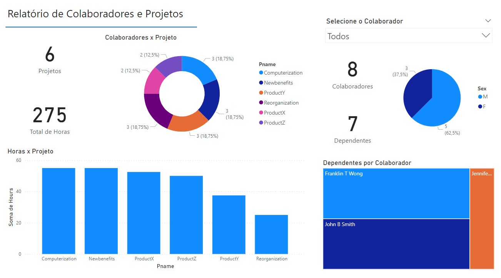

# dio-powerbi-etl
Desafio de coleta, obtenção e transformação de dados com Power BI e MySQL na Azure.

## 14. Explique por que, neste caso supracitado, podemos apenas utilizar o mesclar e não o atribuir. 
A operação de acrescentar consultas soma as linhas de ambas, enquanto a mescla combina os dados de acordo com uma coluna em comum. Como precisamos adicionar colunas novas relacionando os dados e acrescentar apenas adicionaria mais linhas ao final da consulta, a única forma viável é mesclar.

## Relatório de Exemplo

Construído a partir dos dados já tratados